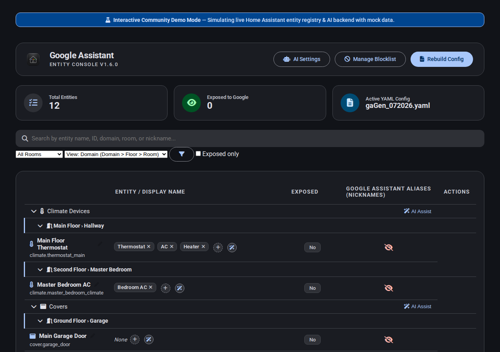
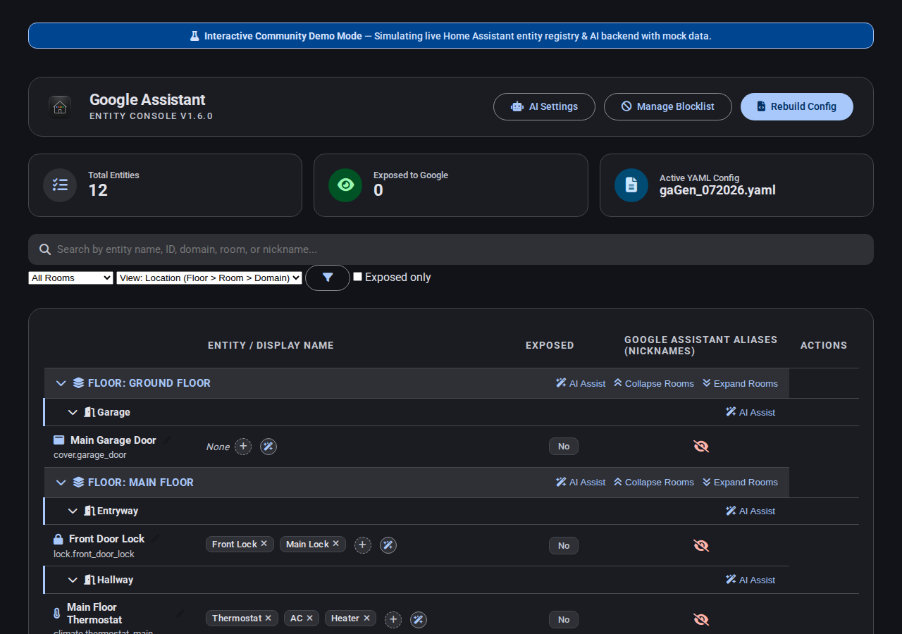

# Google Assistant Entity Console

Google Assistant Entity Console is a native Home Assistant custom component that provides a direct sidebar dashboard to manage which entities are exposed to Google Assistant, update friendly names and aliases (nicknames) inline, and maintain a regex-supported blocklist. 

It acts as a clean configuration manager, eliminating the need to write complex manual YAML blocks or restart/reload configurations by hand.

## Key Features

- **Native Integration**: Runs entirely inside the Home Assistant process and registers a clean panel in your sidebar.
- **Dual Grouping Layouts**: 
  - **Location-first (default)**: Groups entities by Floor -> Room -> Domain.
  - **Domain-first (alternate)**: Groups entities by Domain -> Floor -> Room.
- **Batch Actions**: One-click collapse and expand controls for nested child sections (e.g. collapse all rooms on a floor or collapse all domains in a room).
- **Direct Row Interactions**:
  - **Click-to-Toggle Status**: Click directly on the exposed status badge (*Exposed*, *Pending Add*, *Pending Remove*, *No*) to toggle it.
  - **Inline Renaming**: Hover over the friendly name and click the pencil icon to rename the entity in place.
  - **Nickname Badges**: View, add, and remove aliases (nicknames) directly on the entity row.
- **Regex Blocklist Manager**: Permanently hide entities using regular expression patterns. Use the header manager modal or click the block button on any entity row to generate a precise blocklist pattern.
- **Independent Generation & Restart**: Rebuild the YAML configuration file dynamically and choose whether to perform a restart to apply the modifications immediately.

## Installation

### Method 1: HACS (Recommended)

1. Open HACS in Home Assistant.
2. Click the three dots in the top-right corner and select **Custom repositories**.
3. Paste the repository URL: `https://github.com/spelech/googleAssistantConfigGen`
4. Choose **Integration** as the category and click **Add**.
5. Find **Google Assistant Entity Console** in HACS, click **Download**, and select the latest version.
6. Restart Home Assistant.

### Method 2: Manual Installation

1. Download the latest release from the repository.
2. Copy the `custom_components/google_assistant_entity_console/` directory into your Home Assistant `/config/custom_components/` folder.
3. Restart Home Assistant.

## Configuration

To activate the integration and register the sidebar panel, add the following key to your `configuration.yaml` file:

```yaml
google_assistant_entity_console:
```

Restart Home Assistant to apply the configuration. A new **Google Sync** link will appear in your sidebar.

### Connecting to Google Assistant

Before generating configurations, make sure the built-in Google Assistant integration is configured and linked. Add a line referencing the configuration file in your main `configuration.yaml` matching this pattern:

```yaml
google_assistant: !include gaGen_062226.yaml
```

The console will automatically detect, read, and write to the active configuration file.

## Screenshot Previews

### Location-first Layout (Floor > Room > Domain)


### Domain-first Layout (Domain > Floor > Room)


### Regex Blocklist Manager

