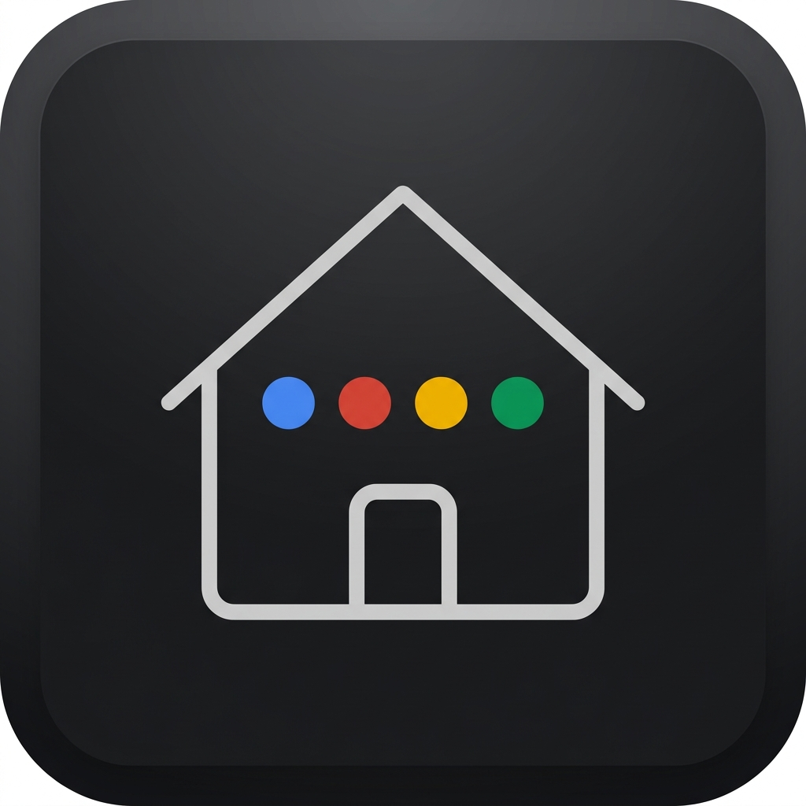

# Google Assistant Entity Console

<p align="center">
  
</p>

<p align="center">
  <b>A native Home Assistant custom component providing a powerful sidebar dashboard to visually manage Google Assistant entity exposure, voice nicknames, regex blocklists, and automated YAML generation.</b>
</p>

<p align="center">
  <a href="docs/DEMO_SETUP.md"><b>🌐 Interactive Live Demo</b></a> •
  <a href="#key-features">Key Features</a> •
  <a href="#installation">Installation</a> •
  <a href="#configuration">Configuration</a> •
  <a href="#ai-assistant-integration">AI Features</a> •
  <a href="#documentation-hub">Documentation Hub</a> •
  <a href="#faq--troubleshooting">FAQ</a>
</p>

---

## Why Self-Hosters Need This

Configuring entities exposed to Google Assistant in Home Assistant traditionally requires writing tedious manual YAML configuration blocks, remembering long entity IDs, managing aliases manually, and restarting or reloading YAML configurations by hand.

**Google Assistant Entity Console** replaces YAML friction with an elegant, responsive sidebar panel. It automatically scans your Home Assistant registry (floors, areas, devices, entities), renders dual-layout entity trees, auto-suggests voice nicknames using local or cloud AI, and safely generates clean YAML files (`gaGen_YYMMDD.yaml`) with optional zero-downtime reloads.

---

## Key Features

- **Native Sidebar Panel**: Seamlessly integrates into your Home Assistant sidebar as a native panel (`google-assistant-entity-console-panel`).
- **Dual Grouping Layouts**:
  - **Location-First (Default)**: Group entities by `Floor -> Room (Area) -> Domain -> Entity Row`.
  - **Domain-First (Alternate)**: Group entities by `Domain -> Floor -> Room (Area) -> Entity Row`.
- **Batch Controls**: Expand or collapse nested sections across an entire floor, room, or domain with a single click.
- **Direct Row Interactions**:
  - **Click-to-Toggle Status**: Instantly toggle entity exposure status (*Exposed*, *Pending Add*, *Pending Remove*, *Not Exposed*).
  - **Inline Renaming**: Edit entity display names directly on the row.
  - **Voice Nickname Chips**: View, add, or delete voice aliases (nicknames) with real-time chip management.
- **Regex Blocklist Manager**: Permanently hide unwanted entities or domain patterns (e.g. `.*_battery_level$`) using regular expression rules with live validation.
- **Built-in AI Assistant**:
  - Automatically suggest entity exposure based on natural-language requests (e.g., *"Expose all living room lights and climate controls"*).
  - Bulk and room-aware voice nickname generation using local LLMs (Ollama, LocalAI, vLLM) or cloud endpoints (OpenAI, OpenRouter, Groq), as well as Home Assistant Native Conversation Agents.
- **Native Theme Inheritance**: Automatically matches your active Home Assistant dashboard theme (light, dark, Mushroom, Catppuccin, Nord, etc.) via native CSS custom properties (`--primary-background-color`, etc.).
- **Dynamic YAML Generation & Reload**: Rebuilds `gaGen_YYMMDD.yaml` dynamically with full support for Home Assistant `!secret` and `!include` tags, and offers instant zero-downtime reload via `homeassistant.reload_config_entry`.

---

## Screenshot Previews

### Location-First Layout (`Floor -> Room -> Domain`)


### Domain-First Layout (`Domain -> Floor -> Room`)


### Regex Blocklist Manager


---

## Installation

### Method 1: HACS (Recommended)

1. Open **HACS** in your Home Assistant sidebar.
2. Click the three dots (⋮) in the top-right corner and select **Custom repositories**.
3. Enter the repository URL: `https://github.com/spelech/googleAssistantConfigGen`
4. Select **Integration** as the Category and click **Add**.
5. Find **Google Assistant Entity Console** in HACS, click **Download**, and select the latest release.
6. Restart Home Assistant.

### Method 2: Manual Installation

1. Download the latest release `.zip` from the [Releases](https://github.com/spelech/googleAssistantConfigGen/releases) tab.
2. Extract and copy the `custom_components/google_assistant_entity_console/` directory into your Home Assistant `/config/custom_components/` directory.
3. Restart Home Assistant.

---

## Configuration

Once installed and Home Assistant has restarted:

1. In Home Assistant, navigate to **Settings** > **Devices & Services**.
2. Click **Add Integration** in the bottom-right corner.
3. Search for **Google Assistant Entity Console** and select it.
4. Complete the configuration wizard. A new **Google Sync** panel will appear in your sidebar.

### Linking with `configuration.yaml`

To link the generated YAML configuration file to Home Assistant's built-in `google_assistant:` integration, add an include statement pointing to the generated file inside your `configuration.yaml`:

```yaml
google_assistant: !include gaGen_062226.yaml
```

The console will automatically read, update, and rewrite this file whenever you trigger a rebuild from the sidebar panel.

---

## AI Assistant Integration

The console includes a privacy-first AI engine designed for self-hosters:

- **100% Local LLMs**: Point the base URL to your local Ollama, LocalAI, vLLM, or LM Studio instance (`http://192.168.1.x:11434/v1`) for complete data privacy.
- **HA Native Conversation Agents**: Connect directly to Home Assistant Assist / Conversation agents using internal `async_converse`.
- **Context-Aware Alias Generation**: When generating nicknames for an entity, the AI inspects all other entities in the same room to prevent duplicate or conflicting voice commands.

For setup details and custom prompt templates, see the [AI Integration Guide](docs/AI_INTEGRATION.md).

---

## Documentation Hub

Explore the detailed architecture and technical guides:

- 🏗️ **[Architecture Overview](docs/ARCHITECTURE.md)**: Deep dive into `views.py`, entity registry resolution, YAML SafeDumper/SafeLoader engine, regex blocklisting, and iframe Web Component architecture.
- 🤖 **[AI Integration Guide](docs/AI_INTEGRATION.md)**: Technical guide on OpenAI-compatible local/remote endpoints, HA Assist agent integration, and prompt customization.
- 🎨 **[Dashboard Theme Integration](docs/THEMING.md)**: Technical breakdown of how the UI maps Home Assistant CSS variables (`--primary-background-color`, etc.) to Material Design 3 design tokens.
- 🌐 **[Interactive Demo Setup](docs/DEMO_SETUP.md)**: How to host and run an interactive zero-backend live demo on GitHub Pages using dummy mock data.

---

## FAQ & Troubleshooting

### Q: Do I need to restart Home Assistant every time I change exposed entities?
**No.** After rebuilding your YAML configuration file in the console, you can select the **Reload Config** option to trigger `homeassistant.reload_config_entry` for zero-downtime updates.

### Q: Will this overwrite my existing secrets or custom YAML tags?
**No.** The backend uses custom `PyYAML` `SafeDumper` and `SafeLoader` representers to preserve `!secret` and `!include` tags without breaking your configuration files.

### Q: Why are some of my sensors or entities missing from the console?
Google Assistant only supports specific Home Assistant domains (`light`, `switch`, `climate`, `lock`, `cover`, `fan`, `vacuum`, `media_player`, `alarm_control_panel`, `camera`, `scene`, `script`, etc.) and binary sensors with specific device classes (`door`, `garage_door`, `lock`, `opening`, `window`, etc.). Unsupported entities are automatically filtered out.

### Q: Is my data sent to external servers when using AI features?
**Not unless you choose to use a cloud provider.** You can configure the AI settings to use a local LLM (e.g. Ollama or LocalAI running on your local network) or a local Home Assistant Assist agent, keeping 100% of your data inside your local network.

---

## License

Distributed under the MIT License. See `LICENSE` for more information.
