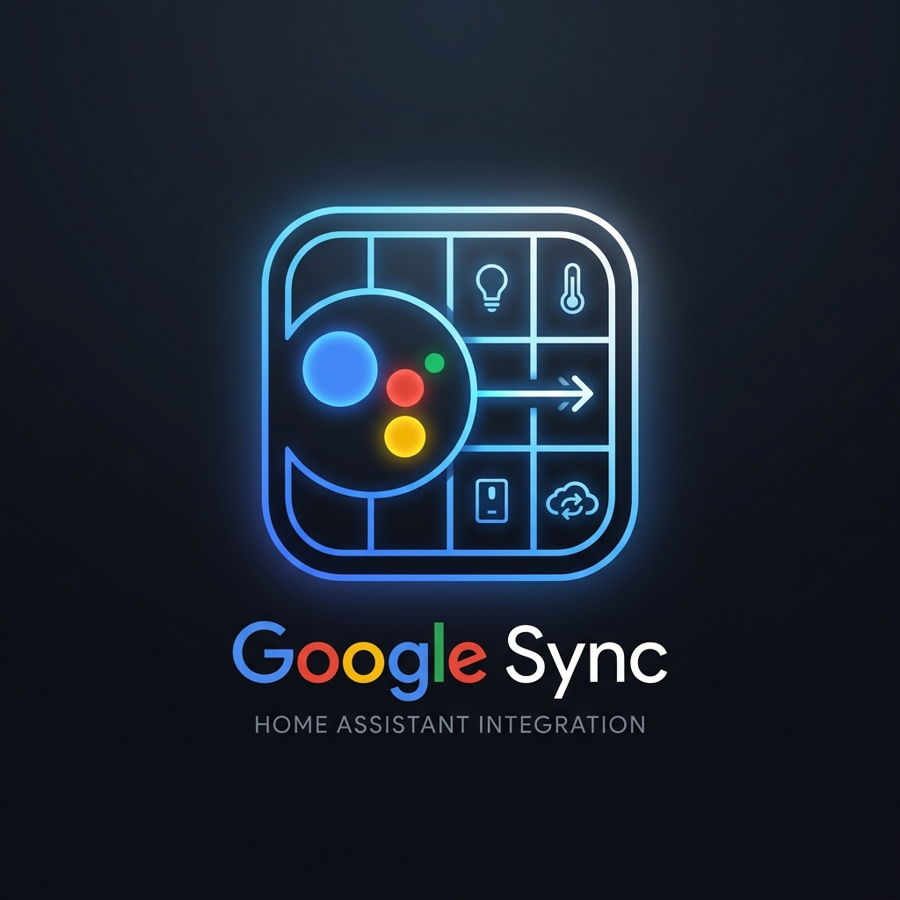

# Google Assistant Entity Console

<p align="center">
  
</p>

Google Assistant Entity Console is a native Home Assistant custom component that provides a sidebar dashboard UI to manage which entities are exposed to Google Assistant, update their friendly names and aliases, generate the configuration YAML, and trigger reloads and syncs.

It replaces standalone proxy containers and connects directly to Home Assistant registries.

## Features

- Native integration running inside the Home Assistant process.
- Programmatic sidebar panel registration.
- Dynamic entity loading directly from Home Assistant entity, device, and area registries.
- Custom names and alias badges update entity registry parameters.
- One-click configuration generator that formats, validates, writes dated configuration files, updates the include reference in configuration.yaml, and reloads core configs before requesting a Google Assistant sync.
- Secure, session-based authentication using Home Assistant's local credentials.

## Requirements

Before using this console, ensure you have:
1. The built-in Google Assistant integration configured in Home Assistant.
2. A line referencing the configuration file in your main `configuration.yaml` matching this pattern:
   ```yaml
   google_assistant: !include gaGen_062226.yaml
   ```

## Installation

### Method 1: HACS (Recommended)

1. Open HACS in Home Assistant.
2. Click the three dots in the top-right corner and select **Custom repositories**.
3. Paste the URL of this repository: `https://github.com/spelech/googleAssistantConfigGen`
4. Select **Integration** as the category and click **Add**.
5. Find the **Google Assistant Entity Console** card in HACS, click **Download**, and select the latest version.
6. Restart Home Assistant.

### Method 2: Manual Installation

1. Download the latest release from the repository.
2. Copy the `custom_components/google_assistant_entity_console/` directory into your Home Assistant `/config/custom_components/` folder.
3. Restart Home Assistant.

## Configuration

To activate the console, add the integration domain to your `configuration.yaml`:

```yaml
google_assistant_entity_console:
```

Once Home Assistant restarts, the **Google Sync** link will appear in your sidebar.
