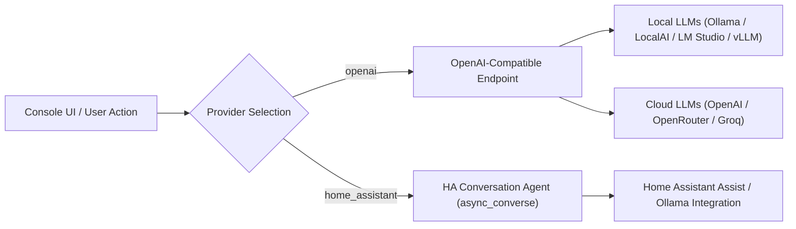

# AI Assistant Integration Guide

Google Assistant Entity Console features a flexible AI engine designed specifically for home automation self-hosters. It automates entity exposure decisions and alias creation using local LLMs or cloud providers.

---

## 1. Overview & Capabilities

Setting up voice control with Google Assistant often requires coming up with natural-sounding voice aliases (nicknames) for dozens of smart devices, as well as deciding which entities should be accessible. The built-in AI Assistant simplifies this through three primary features:

### 1.1 Intent-Driven Exposure Suggestions (`AISuggestExposureView`)
Instead of manually sifting through hundreds of Home Assistant entities, users can type natural language requests like:
> *"Expose all living room lights, kitchen climate controls, and front door locks."*

The AI evaluates the system entity inventory and returns a JSON list of matching entity IDs, instantly updating the pending exposure selection in the UI.

### 1.2 Bulk Nickname Generation (`AIGenerateNicknamesView`)
Generates 2–4 natural voice aliases for a batch of entities. For example, for `light.kitchen_pendant_light_1`:
- *"Kitchen Pendant"*
- *"Island Light"*
- *"Overhead Light"*

### 1.3 Room-Aware Single Entity Generation (`AIGenerateSingleEntityNicknameView`)
When generating nicknames for a specific device, the AI inspects **all other entities in the same room** along with their current nicknames. This prevents duplicate or confusing aliases (e.g. avoiding naming two lights in the same room *"Desk Lamp"*).

---

## 2. Provider Architecture

The AI module supports two distinct provider backends:



### 2.1 Provider 1: OpenAI-Compatible APIs
Works with any API implementing the standard `/v1/chat/completions` and `/v1/models` endpoints:
- **Local Self-Hosted**: [Ollama](https://ollama.com/) (via OpenWebUI or direct API), [LocalAI](https://localai.io/), [LM Studio](https://lmstudio.ai/), [vLLM](https://github.com/vllm-project/vllm).
- **Cloud Providers**: OpenAI (GPT-4o, GPT-4o-mini), OpenRouter, Groq, DeepSeek.

#### Configuration Options:
- **Base URL**: e.g., `http://192.168.1.100:11434/v1` (Ollama) or `https://openrouter.ai/api/v1`
- **API Key**: Optional for local endpoints; required for cloud endpoints.
- **Model Selector**: Automatically queries `/v1/models` (including OpenRouter pricing metadata where available).

### 2.2 Provider 2: Home Assistant Native Conversation Agents
Directly integrates with Home Assistant's internal `conversation` component via [`async_converse`](file:///drives/nfs/repos/google-assistant-entity-console/custom_components/google_assistant_entity_console/views.py#L589).
- Enables use of local Assist conversation agents (such as Home Assistant's Ollama integration or Extended OpenAI Conversation) without needing separate API tokens inside the custom component.
- Selectable directly via dropdown populated by `GET /api/google_assistant_entity_console/ai/ha_agents`.

---

## 3. Prompt Templates & Customization

Prompt templates are customizable and stored in JSON format at:
`google_assistant_entity_console_ai_settings.json`

### 3.1 Bulk Nickname Prompt Template
```
You are an assistant helping configure Google Assistant aliases for smart home entities.
For the following entity, generate 2-4 clean, natural-language nicknames (aliases) that a user would typically say to control the device.
Do NOT include markdown, explanations, bullet points, numbers, quotes, or punctuation.
Return the nicknames ONLY as a single comma-separated list on a single line.

Entity ID: {entity_id}
Friendly Name: {friendly_name}
Aliases:
```

### 3.2 Room-Aware Single Entity Prompt Template
```
You are an assistant helping configure Google Assistant aliases for a specific smart home entity.
For the target entity, generate 2-4 clean, natural-language nicknames (aliases) that a user would typically say to control the device.
Avoid markdown, explanations, bullet points, numbers, quotes, or punctuation.
Use the context of other entities in the same room to avoid duplicate, confusing, or conflicting names.
Return the nicknames ONLY as a single comma-separated list on a single line.

Target Entity ID: {entity_id}
Target Friendly Name: {friendly_name}
Other Entities in same room: {room_context}
Aliases:
```

### 3.3 Exposure Intent Prompt Template
```
You are an assistant helping configure which smart home entities to expose to Google Assistant.
Given a list of entities with their IDs, names, and domains, and the user's intent: '{user_intent}'.
Determine which entities from the list should be exposed.
Return ONLY a JSON list of entity IDs that should be exposed. Do not wrap in markdown codeblocks.

Entities:
{entities_list}
```

---

## 4. Privacy & Self-Hosting Best Practices

For privacy-focused self-hosters:
1. **Zero External Data Leakage**: Point the Base URL to a local Ollama instance (`http://localhost:11434/v1`) running open-weights models such as `llama3`, `mistral`, or `qwen2.5`.
2. **Low Memory Overhead**: Since nickname and exposure tasks are lightweight classification/generation tasks, small 3B–8B parameter models work exceptionally well.
3. **No Third-Party Cloud Required**: AI features can be completely disabled or pointed purely locally.
