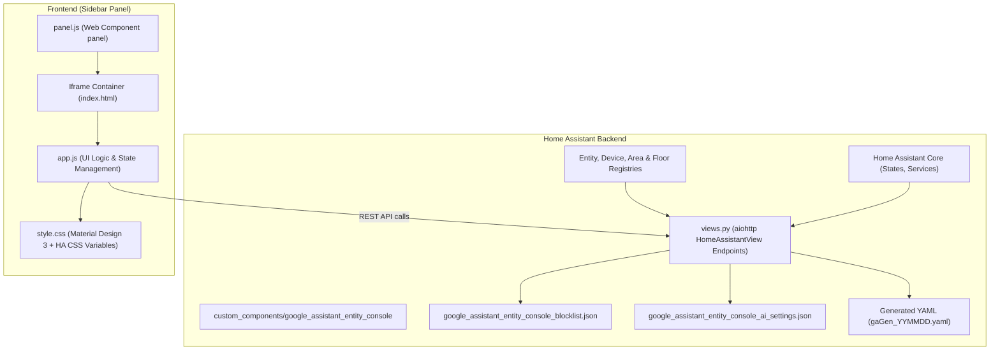

# Google Assistant Entity Console Architecture

This document provides a detailed technical overview of the **Google Assistant Entity Console** Home Assistant custom component architecture.

---

## 1. System Overview

Google Assistant Entity Console is a native Home Assistant integration that provides a direct sidebar management dashboard for exposing, hiding, alias-tagging, and blocklisting Home Assistant entities exposed to Google Assistant.

It operates entirely inside the Home Assistant process, combining an `aiohttp` HTTP API backend with a responsive single-page web application served inside an iframe panel.



---

## 2. Component Lifecycle (`__init__.py`)

The integration entrypoint is defined in [`custom_components/google_assistant_entity_console/__init__.py`](file:///drives/nfs/repos/google-assistant-entity-console/custom_components/google_assistant_entity_console/__init__.py).

### Setup Sequence:
1. **Async Setup Entry** (`async_setup_entry`):
   - Reads integration manifest version.
   - Registers static HTTP paths (`/google_assistant_entity_console/static`) pointing to the component's `static/` directory.
   - Registers all backend API HTTP views on `hass.http`.
   - Registers the custom sidebar panel (`async_register_panel`) pointing to `panel.js`.
2. **Unload Entry** (`async_unload_entry`):
   - Removes the sidebar panel (`async_remove_panel`).

```python
# Custom Panel Registration
frontend.async_register_panel(
    hass,
    frontend_url_path=DOMAIN,
    webcomponent_name="google-assistant-entity-console-panel",
    js_url=f"/google_assistant_entity_console/static/panel.js?v={version}",
    sidebar_title="Google Sync",
    sidebar_icon="mdi:google-assistant",
    config={"version": version},
    require_admin=True,
)
```

---

## 3. Backend Architecture (`views.py`)

The backend is built using Home Assistant's `HomeAssistantView` class (extending `aiohttp.web.View`).

### 3.1 Entity Resolution Engine
When the frontend queries `/api/google_assistant_entity_console/entities`, [`async_fetch_entities_data`](file:///drives/nfs/repos/google-assistant-entity-console/custom_components/google_assistant_entity_console/views.py#L115) aggregates data from:
- **Entity Registry** (`entity_registry.async_get(hass)`): Fetches entity ID, disabled/hidden status, device class.
- **Device Registry** (`device_registry.async_get(hass)`): Resolves device-level area assignments and friendly names.
- **Area Registry** (`area_registry.async_get(hass)`): Resolves room names and floor assignments.
- **Floor Registry** (`floor_registry.async_get(hass)`): Resolves floor names.
- **Light Group Detection**: Scans light groups and standard groups (`light.*`, `group.*`) to tag child entities as group members.
- **Supported Domain Filter**: Validates entities against Google Assistant supported domains (`light`, `switch`, `climate`, `lock`, `cover`, `fan`, `vacuum`, `media_player`, `alarm_control_panel`, `camera`, `scene`, `script`, `sensor`, `binary_sensor`, etc.).

### 3.2 Dynamic YAML Engine
The integration parses and generates YAML configuration files compatible with Home Assistant's native `google_assistant:` integration.

- **Safe YAML Parser/Dumper**: Custom `PyYAML` representers and loaders handle custom Home Assistant YAML tags (`!secret` and `!include`) without throwing parsing errors.
- **Include Detection**: Scans `configuration.yaml` for regex pattern `google_assistant:\s*!include\s*(gaGen_\d{6}\.yaml)`.
- **Rebuild & Timestamping**: Generates new timestamped file (e.g. `gaGen_062226.yaml`) containing:
  ```yaml
  project_id: YOUR_PROJECT_ID
  service_account: !include SERVICE_ACCOUNT.json
  report_state: true
  exposed_default: false
  entity_config:
    light.living_room_light:
      expose: true
      name: "Living Room Light"
      aliases:
        - "Main Light"
        - "Overhead Light"
  ```
- **Live Reload / Restart**: Offers choice to execute `homeassistant.reload_config_entry` (for zero-downtime updates) or `homeassistant.restart`.

### 3.3 Regex Blocklist Engine
Entities matching user-defined regular expressions are filtered out before being rendered in the UI or exported to YAML.
- Stored persistently in JSON at `google_assistant_entity_console_blocklist.json`.
- Endpoints:
  - `GET /api/google_assistant_entity_console/blocklist`: Retrieves active regex patterns.
  - `POST /api/google_assistant_entity_console/blocklist`: Overwrites regex patterns with syntax validation (`re.compile`).
  - `POST /api/google_assistant_entity_console/blocklist/add`: Appends a new regex pattern.

---

## 4. Frontend Architecture

The frontend is a lightweight Single-Page Application (SPA) contained within [`custom_components/google_assistant_entity_console/static/`](file:///drives/nfs/repos/google-assistant-entity-console/custom_components/google_assistant_entity_console/static/).

```
static/
├── index.html   # Main HTML layout & modal templates
├── app.js       # Core UI state management, rendering, & API bindings
├── style.css    # MD3 design system & Home Assistant CSS theme mapping
└── panel.js     # Custom Web Component wrapper hosting index.html in an iframe
```

### 4.1 Iframe Security & Authentication (`panel.js`)
The panel Web Component (`<google-assistant-entity-console-panel>`) instantiates an `iframe` pointing to `/google_assistant_entity_console/static/index.html` and passes the active Home Assistant access token (`hass.auth.accessToken`) in the URL query string for authenticated API access.

### 4.2 Dual Grouping Layout Engine
The UI supports two real-time organizational hierarchies:
1. **Location-First (Default)**:
   $$\text{Floor} \longrightarrow \text{Room (Area)} \longrightarrow \text{Domain} \longrightarrow \text{Entity Row}$$
2. **Domain-First (Alternate)**:
   $$\text{Domain} \longrightarrow \text{Floor} \longrightarrow \text{Room (Area)} \longrightarrow \text{Entity Row}$$

### 4.3 Interactive Entity Row Controls
Each entity row rendered by `app.js` provides:
- **Click-to-Toggle Status**: Toggles state between *Exposed*, *Pending Add*, *Pending Remove*, and *Unexposed*.
- **Inline Renaming**: Double-click or edit icon to alter entity `display_name`.
- **Nickname Badges**: Interactive chip list allowing instant addition/deletion of voice aliases.
- **Quick Blocklist Button**: One-click regex pattern creation for blocking target entity domain or naming patterns.

---

## 5. API Endpoints Reference

| Endpoint | Method | Description |
| :--- | :--- | :--- |
| `/api/google_assistant_entity_console/entities` | `GET` | Fetches entity list with area/floor/group context and exposed YAML state |
| `/api/google_assistant_entity_console/yaml` | `POST` | Rebuilds YAML configuration file and triggers HA reload/restart |
| `/api/google_assistant_entity_console/blocklist` | `GET`, `POST` | Retrieves or replaces the regex blocklist |
| `/api/google_assistant_entity_console/blocklist/add` | `POST` | Appends a single pattern to the blocklist |
| `/api/google_assistant_entity_console/ai/settings` | `GET`, `POST` | Manages AI provider configuration & prompt templates |
| `/api/google_assistant_entity_console/ai/models` | `POST` | Fetches available models & pricing from OpenAI-compatible endpoint |
| `/api/google_assistant_entity_console/ai/ha_agents` | `GET` | Lists Home Assistant Assist / Conversation agents |
| `/api/google_assistant_entity_console/ai/generate_nicknames` | `POST` | Bulk nickname generation for entity array |
| `/api/google_assistant_entity_console/ai/generate_single_nickname` | `POST` | Context-aware single entity nickname generation |
| `/api/google_assistant_entity_console/ai/suggest_exposure` | `POST` | Intent-driven entity selection |
