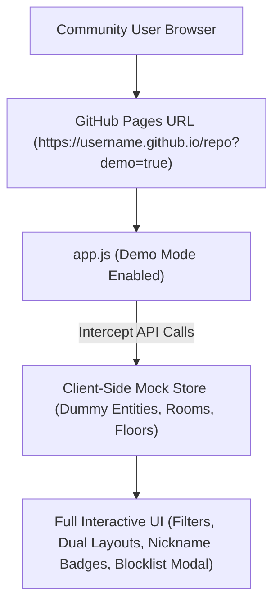

# Interactive GitHub Pages Live Demo Setup Guide

This document outlines how to deploy and run an interactive, zero-backend live demo of **Google Assistant Entity Console** on GitHub Pages using realistic dummy data.

---

## 1. Overview

Allowing community members on Reddit and Home Assistant forums to test the interface before installing it significantly increases trust and engagement.

By supplying a `?demo=true` query parameter in the URL (or hosting a dedicated demo HTML entrypoint), the frontend [`app.js`](file:///drives/nfs/repos/google-assistant-entity-console/custom_components/google_assistant_entity_console/static/app.js) bypasses live `/api/google_assistant_entity_console/*` network calls and serves pre-configured mock datasets.



---

## 2. Mock Dataset Structure

When operating in demo mode, `app.js` initializes a rich mock home environment:

### Sample Dummy Entities
```json
[
  {
    "entity_id": "light.living_room_pendant",
    "name": "Pendant Light",
    "display_name": "Living Room Pendant",
    "domain": "light",
    "area_name": "Living Room",
    "floor_name": "Main Floor",
    "is_exposed": true,
    "aliases": ["Main Light", "Chandelier"],
    "is_group_member": false
  },
  {
    "entity_id": "climate.master_thermostat",
    "name": "Master Thermostat",
    "display_name": "Bedroom Climate Control",
    "domain": "climate",
    "area_name": "Master Bedroom",
    "floor_name": "Second Floor",
    "is_exposed": false,
    "aliases": ["AC", "Heater"],
    "is_group_member": false
  },
  {
    "entity_id": "lock.front_door_deadbolt",
    "name": "Front Door Deadbolt",
    "display_name": "Front Door Lock",
    "domain": "lock",
    "area_name": "Entryway",
    "floor_name": "Main Floor",
    "is_exposed": true,
    "aliases": ["Front Lock"],
    "is_group_member": false
  }
]
```

---

## 3. Demo API Interceptor Implementation

In `app.js`, network fetch calls check for the demo parameter:

```javascript
const isDemoMode = new URLSearchParams(window.location.search).get('demo') === 'true';

async function fetchEntities() {
    if (isDemoMode) {
        console.log("[Demo Mode] Serving mock entity dataset");
        return MOCK_ENTITIES_DATASET;
    }
    const response = await fetch('/api/google_assistant_entity_console/entities');
    return await response.json();
}
```

### Mock AI Assistant Responses
In demo mode, clicking **Generate Nicknames** or **Suggest Exposure** returns pre-built smart responses:
- **Single Entity AI Prompt**: Generates `"reading lamp, couch light"` for `light.living_room_lamp`.
- **Intent Exposure**: If user enters *"Expose all bedroom lights"*, filters and returns bedroom entity IDs automatically.

---

## 4. GitHub Pages Deployment Steps

To enable the demo on your GitHub repository:
1. In your GitHub repository, go to **Settings** > **Pages**.
2. Under **Build and deployment**:
   - Source: **Deploy from a branch**
   - Branch: `main` / Folder: `/docs` (or root `/`)
3. Access the demo live at:
   `https://<username>.github.io/<repository-name>/custom_components/google_assistant_entity_console/static/index.html?demo=true`
4. Add the live demo URL banner directly to the top of `README.md`!
