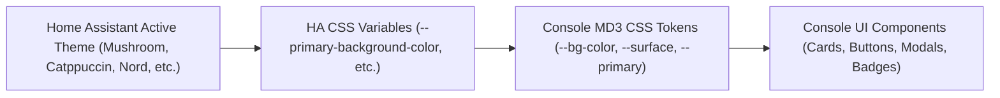

# Dashboard Theme Integration Guide

Google Assistant Entity Console is designed to seamlessly blend into any Home Assistant environment. It automatically inherits the user's active Home Assistant theme (light, dark, or third-party custom themes) with zero configuration required.

---

## 1. How Theme Inheritance Works

Home Assistant defines native CSS custom properties on the root document (`:root`) and custom elements. When the console panel opens inside the sidebar iframe, [`style.css`](file:///drives/nfs/repos/google-assistant-entity-console/custom_components/google_assistant_entity_console/static/style.css) maps standard Home Assistant theme variables directly into a modern **Material Design 3 (MD3)** design token system.

---

## 2. CSS Variable Mapping Table

The table below demonstrates how Home Assistant theme variables map to the console's Material Design 3 variables in [`style.css`](file:///drives/nfs/repos/google-assistant-entity-console/custom_components/google_assistant_entity_console/static/style.css#L1-L27):

| Console Token | Primary Home Assistant Variable Fallback | Default Value | Description |
| :--- | :--- | :--- | :--- |
| `--bg-color` | `var(--primary-background-color)` | `#111318` | Dashboard overall background |
| `--surface` | `var(--card-background-color, var(--secondary-background-color))` | `#1a1c22` | Cards, nested panels, header background |
| `--surface-variant` | `var(--clear-background-color, var(--app-header-background-color))` | `#2e3036` | Secondary input fields, modal header backgrounds |
| `--primary` | `var(--primary-color)` | `#a8c7fa` | Primary buttons, active domain chips, icons |
| `--primary-container` | `var(--light-primary-color, var(--primary-color))` | `#00458f` | Container highlights & badge backgrounds |
| `--on-surface` | `var(--primary-text-color)` | `#e2e2e9` | Main body text |
| `--on-surface-variant` | `var(--secondary-text-color)` | `#c4c6d0` | Subtitles, entity ID metadata, labels |
| `--outline` | `var(--outline-color, var(--divider-color))` | `#8e9099` | Component borders & card outlines |
| `--border` | `var(--divider-color, var(--border-color))` | `#44474e` | Section divider lines |
| `--font-main` | `var(--paper-font-common-font-family)` | `Roboto, sans-serif` | Typography font family |

---

## 3. Supported Home Assistant Themes

Because the mapping relies exclusively on standard Home Assistant CSS tokens, the console natively adapts to all popular community themes without extra CSS files or plugins:

- **Default Home Assistant Theme** (Light & Dark Mode)
- **Mushroom Theme** (Light & Dark)
- **Catppuccin** (Latte, Frappé, Macchiato, Mocha)
- **iOS Themes** (Light & Dark)
- **Nord & Dracula Themes**
- **Minimalist & Soft UI Themes**

When the user switches themes in Home Assistant settings or toggles Dark Mode, the iframe automatically reflects the updated colors.

---

## 4. MD3 UI Components & Micro-Interactions

The UI features a clean, responsive layout built with vanilla CSS:

- **Pill Shape Buttons (`.btn`)**: Styled with `border-radius: 100px` following MD3 specifications.
- **Backdrop Blur Modals (`.modal-backdrop`)**: Semi-transparent overlays with `backdrop-filter: blur(8px)` for modern depth.
- **Interactive Domain Chips (`.domain-chip`)**: Filter chips with smooth hover scale transitions and dynamic active state highlighting.
- **Status Badges**: Color-coded indicator pills:
  - **Exposed**: Green (`var(--success-color)`)
  - **Pending Add**: Blue / Primary (`var(--primary-color)`)
  - **Pending Remove**: Amber / Warning
  - **Not Exposed**: Muted Neutral (`var(--secondary-text-color)`)
